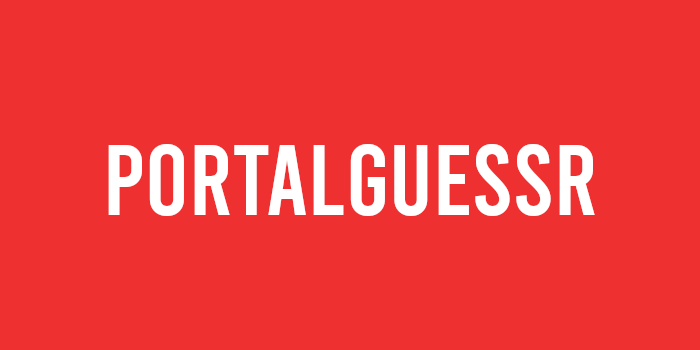

<h1 align="center">
  <br />
  <a href="https://github.com/XnonXte/PortalGuessr"
    ></a>
  <br />
  PortalGuessr
  <br />
</h1>

<h4 align="center">Guessing Bot for Portal Maps.</h4>

<p align="center">
  <a href="https://github.com/XnonXte/PortalGuessr/commits/main">
</a>
  <a href="https://github.com/XnonXte/PortalGuessr/releases/latest">
    
  </a>
    <a href="http://makeapullrequest.com">
    
  </a>
</p>

<p align="center">
  <a href="#overview">Overview</a>
  -
  <a href="#invite-the-bot">Invite</a>
  -
  <a href="#contributions">Contributions</a>
  -
  <a href="#credits">Credits</a>
  -
  <a href="#installation">Instalation</a>
  -
  <a href="#license">License</a>
</p>

# Overview

PortalGuessr is a discord bot that challenges you to guess a Portal chamber from a random picture taken from various locations, similar to GeoGuessr, thus the name PortalGuessr. Written in Python with [discord.py](https://github.com/Rapptz/discord.py) library.

See [previews](previews/) for previews of the bot.

### Invite The Bot

PortalGuessr is an add-free, no paywall, and open-source project. Invite it to your own server with no further setup needed!
| [INVITE LINK](https://discord.com/api/oauth2/authorize?client_id=1117773586522968105&permissions=2147601472&scope=bot%20applications.commands) |
| ----------- |

## Contributions

PortalGuessr is in continuous development, and it's currently supported by a single person (me). So if you want to contribute, please join our [Official Discord Server](https://discord.gg/djWRTEM8XZ)!

## Credits

- Everyone in ITB for beta-testing the bot.

## Installation

1. Download the latest version of the bot (release if available).
2. Install the required dependencies with:

   ```shell
   pip install -r requirements.txt
   ```

3. Change the "TOKEN" variable to your own discord token.
4. Run `python -m main.py` or start **launch.bat**.
5. Done.

## License

This project is released under MIT License, see MIT for more information.

This project uses [discord.py](https://github.com/Rapptz/discord.py) made by Danny Y. (Rapptz) which is distributed under MIT License.

The name PortalGuessr is named after the game [GeoGuessr](https://www.geoguessr.com/) as it imitates the same core concept.
